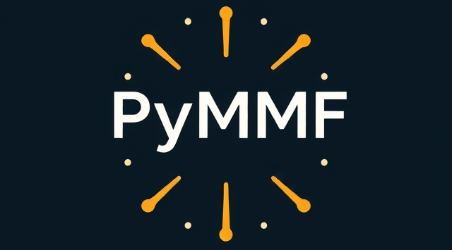

<!-- # PyMMF: Python Micromagnetic Framework by Anton Kettner
Version 0.01

Uses PyCUDA to simulate a magnetic surface on an atomic scale iterating over the LLG equation.

Port of AFS SSH repo to Git repo. Currently being tested on Ubuntu 18.04 with:

## Requirements
- cuda 11.8.0
- anaconda3/2023.03
- ffmpeg/4.0.2
- texlive/2022

## For PhysNet UHH Users
Skip the installation of requirements (1. in getting started), they are already loaded as modules. Run `bash load_modules_physnet.sh` and afterwards proceed as usual (2. create conda env ...)

for testing use graphix01 node, more info at https://wolke.physnet.uni-hamburg.de/index.php/s/6ZgJfXGixe3z4zx?dir=undefined&openfile=71977770

for longer simulations use i.e. `qsub ss_physnet.sh` -> more info at documentation
- `bash ss_physnet.sh` starts the skyrmion simulation on testing node with necessary modules (can be used for jobs; configure with your email address and log directory)
- `bash cc_physnet.sh` starts the current calculation on testing node with necessary modules (can be used for jobs; configure with your email address and log directory)

## Getting Started

1. Install requirements
2. Create conda environment with necessary repositories (quite a lot) using `conda env create --file conda_env_PyMMF.yml`
3. Activate enviroment using
   - `conda init`                # initialize conda
   - `exec $SHELL`               # restart shell
   - `conda activate PyMMF_env`  # activate the created env
5. Run the simulation
    - Navigate to the script directory with `cd skyrmion_simulation/python_scripts`
    - execute a test simulation `python skyrmion_simulation.py` via Python
    - Output is provided via console and into the `OUTPUT` directory

6. Modify masks and Parameters
    - Modify Simulated area which is defined by a png with white/black pixels. (easily done via paint or similar applications)
    - Input Skyrmions and masks and in `needed_files` and rerun with your own specifications
      -> Most parameters can be found inside the class definitions and `__init__` methods in `skyrmion_simulation.py`.
    - Micromagnetic constants or atomistic exchange energy values for Exchange, DM, Anisotropy, ext. B-field can be set.

For micromagnetic simulation choose -> a as the width/length of a square, 
Several Standard Modes are Available
`sim.sim_type` -> The specific parameters modified can be found in the spin class `__init__`.

## Dynamic Current Calculation & Visualization

1. Follow steps 1, 2, and 3 as for Skyrmion Simulation
2. Run with `python current_calculation.py` after navigating to the directory with `cd current_calculation`.

## To Do (For Me)

- Implement temporary directories cleverly into main calculations:
    - Skyrmion simulation
    - Current Calculation
- Functionalize more of the code inside the analysis scripts (split skyrmion simulation into different parts)
- Achieve support for Windows (manage paths with `os.path` or a different module) -->



# 🧲 PyMMF: Python Micromagnetic Framework (v1.00)

> Ein vielseitiges Werkzeug zur Simulation magnetischer Oberflächen auf atomarer Ebene mit Hilfe von PyCUDA.

## 🚀 Projektübersicht

Das PyMMF (Python Micromagnetic Framework) ist eine experimentelle Plattform zur Simulation magnetischer Oberflächen mithilfe der LLG-Gleichung. Der Code nutzt PyCUDA und wurde von einem AFS SSH Repository in ein Git Repository migriert. Aktuell wird es auf Ubuntu 18.04 getestet.

## ✨ Hauptmerkmale

1. 💻 Atomare Simulation: Simuliert magnetische Oberflächen auf atomarer Ebene.
2. 🔄 LLG-Integration: Nutzt die Landau-Lifshitz-Gilbert-Gleichung für Simulationen.
3. 🚀 CUDA-Unterstützung: Beschleunigung mittels CUDA 11.8.0.
4. 🔧 Anpassen von Parametern: Benutzerspezifische Anpassung von Simulationsparametern und -masken.

## 🏗️ Systemarchitektur

Die folgenden Hauptkomponenten steuern die Simulation:

- Simulation Script: Führt die Hauptsimulation durch und bietet verschiedene Einstellmöglichkeiten.
- Parameter Management: Ermöglicht die Anpassung von Simulationsparametern direkt innerhalb der Skripte.

## 🚀 Erste Schritte

1. Repository klonen:   
```shell 
git clone <Ihr_Repository_URL>
cd <Ihr_Repository_Verzeichnis>
```

2. Installieren der Abhängigkeiten: Benötigte Softwareversionen installieren:
   - CUDA 11.8.0
   - Anaconda3/2023.03
   - ffmpeg/4.0.2
   - texlive/2022

3. Erstellen und Aktivieren der Conda-Umgebung:
```shell 
conda env create --file conda_env_PyMMF.yml
conda init
exec $SHELL
conda activate PyMMF_env
```
   
4. Simulation ausführen:
   - Navigieren zur Skript-Direktive: `cd skyrmion_simulation/python_scripts`
   - Führen Sie eine Testsimulation aus: `python skyrmion_simulation.py`

5. Anpassen von Masken und Parametern:
   - Ändern Sie die simulierbare Fläche mithilfe von PNG-Bildern.
   - Skyrmion-Masken in `needed_files` anpassen und neu ausführen.

## ⚙️ PhysNet UHH Benutzerhinweise

Benutzer von PhysNet UHH können Module direkt laden, indem sie `bash load_modules_physnet.sh` ausführen. Weitere Informationen und Testumgebungen finden Sie hier.

## 🔄 Dynamic Current Calculation & Visualization

Folgen Sie den Schritten 1 bis 3, und führen Sie dann die Stromberechnung durch:
```shell
cd current_calculation
python current_calculation.py
```


## 📋 To Do

- 📂 Implementieren von temporären Verzeichnissen in die Hauptberechnungen.
- ⚙️ Weitere Funktionsverlagerungen innerhalb der Analyse-Skripte.
- 🪟 Unterstützung für Windows umsetzen (z.B. mit `os.path`).