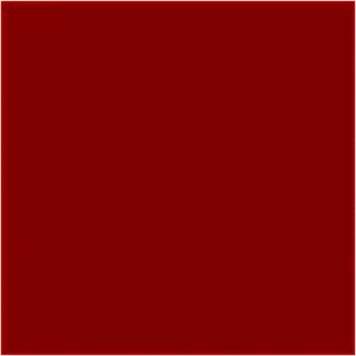

# 🧲 PyMMF: Python Micromagnetic Framework by Anton Kettner (v1.10)

## 🚀 Project Overview

PyMMF (Python Micromagnetic Framework) is the Repo I wrote during my Masterthesis to simulate and analyze micromagnetic behavior. The Framework uses PyCUDA to simulate a magnetic surface on an atomic scale iterating over the LLG equation.

For a more interactive visualization I did a little Unity C# project: https://github.com/AntonKettner/spin_visualization_unity

## ✨ Main Features

1. 💻 Atomic Simulation: Simulates magnetic surfaces on an atomic scale.
2. 🔄 LLG-Integration: Uses the Landau-Lifshitz-Gilbert equation for simulations.
3. 🚀 CUDA-Support: Acceleration via CUDA 11.8.0. -> Kernels written in `kernels` dir
4. 🔧 Parameter Adjustment: User-specific adjustment of simulation parameters and masks.

## 🏗️ System Architecture

The main script containing all the functionality (skyrmion_simulation.py) has been split into several classes in different scripts to improve readability and modularity.
These classes are all found in the `skyrmion_simulation` dir:
- main.py           : Runs the main simulation loop.
- constants.py      : Contains all the constants used in the simulation. -> Material/Physical Constants
- simulation.py     : Contains the important simulation parameters
- gpu.py            : Contains the GPU related code -> sending/receiving data to/from the GPU, grouping of the numerical steps for different calculation methods. (RK4, heun, Euler)
- spin_operations.py: Contains all the micromagnetic functions -> setting skyrmions, initializing the spinfield, etc.
- output.py         : Contains all the output related functions -> saving images, creating movies, etc.

## 🚀 First Steps

1. Clone the repository:   
```shell 
git clone github.com/AntonKettner/PyMMF
cd PyMMF
```

2. Install the dependencies: Install the required software versions:
   - CUDA 11.8.0
   - Anaconda3/2023.03
   - ffmpeg/4.0.2
   - texlive/2022

3. Create and activate the Conda environment:
```shell 
conda env create --file conda_env_PyMMF.yml
conda init
exec $SHELL
conda activate PyMMF_env
```

4. Run your first simulation:
```shell
python skyrmion_simulation/main.py --sim_type "x_current"
```

5. Create your own simulation type:
5.1. Add a new entry in the list "acceptable_sim_types" in main.py (arg_parser method)
5.2. Add an elif check for your simulation type in simulation.py in the __init__ method
What can you change?:
- use a different mask for the simulated area -> black and white PNG in `needed_files` dir
- adjust the timeframe of the simulation, the number of images, etc.
- turn current on/off, adjust the current direction, etc.
-> Test the main functionality of the codebase by running `python testing/testing_basic.py`

## You can also recreate all the Files in the Thesis with:
```shell
python testing/data_gen_thesis.py
```

## ⚙️ PhysNet UHH User Instructions

PhysNet UHH users can load modules directly by running `bash load_modules_physnet.sh`. Further information and test environments can be found here.

## 🔄 Dynamic Current Calculation & Visualization

Follow the steps 1 to 3, and then run the current calculation:
```shell
cd current_calculation
python current_calculation.py
```

## 🎥 Visualization via Unity

-Follow the steps 1 to 3, set save_db flag to True in simulation.py and run a simulation.

-Run the spin_movement_visualization_via_Unity.py script in the analysis dir adjusting the fetch_dir to the sample_dir of your simulation. --> a new dir "databases" will be created in the sample_dir containing spin configurations stored in SQLite database files

-copy these to a custom dir in the Unity project Assets/StreamingAssets/Databases and change the relativePath vars in Assets/Skyr_data_loader.cs and Spin_Visualizer.cs to the path of your custom dir.

--> Enjoy the show!

## 📋 To Do

- 📂 Implementing temporary directories into the main calculations.
- 🪟 Implementing support for Windows (using `os.path`).

## 📺 Examplary output x_current_video


